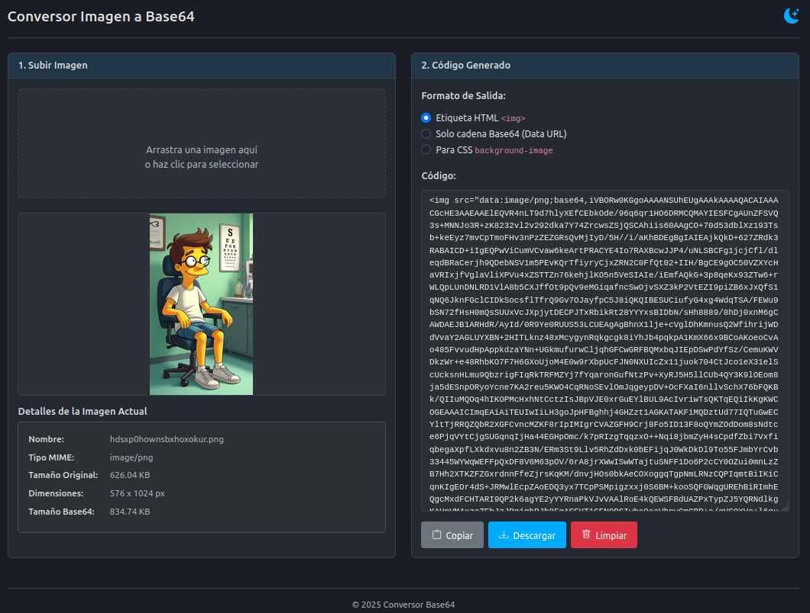

# 🖼️ Online Base64 Image Converter

[](https://opensource.org/licenses/MIT) [](https://soyunomas.github.io/online-base64-image-converter/index.html)

Una herramienta web sencilla y eficiente para convertir imágenes (PNG, JPG, GIF, SVG, WEBP) a cadenas Base64 (Data URLs) directamente en tu navegador. 🚀

## 📝 Descripción Breve

Este proyecto proporciona una interfaz de usuario interactiva para cargar imágenes mediante selección de archivo o arrastrar y soltar (drag & drop). Convierte la imagen seleccionada a formato Base64, muestra una vista previa, detalles del archivo (nombre, tipo, tamaño, dimensiones) y genera el código resultante en varios formatos útiles (etiqueta HTML ``, CSS `background-image`, o la cadena Base64 pura). Todo el procesamiento ocurre localmente en el navegador del usuario, asegurando privacidad y rapidez.

## 🖼️ Captura de Pantalla / Demo



Puedes probar la demo en vivo aquí:

*   **[Demo - Probar Conversor](https://soyunomas.github.io/online-base64-image-converter/index.html)**

## ✨ Características Principales

*   **📤 Carga Fácil:** Soporta arrastrar y soltar (drag & drop) y selección de archivos tradicional.
*   **🖼️ Formatos Soportados:** Convierte los tipos de imagen más comunes: PNG, JPEG, GIF, SVG y WEBP.
*   **⚙️ Conversión Local:** Utiliza la API `FileReader` del navegador para convertir imágenes a Base64 sin necesidad de subirlas a un servidor.
*   **👁️ Vista Previa Instantánea:** Muestra la imagen cargada inmediatamente después del procesamiento.
*   **📊 Detalles Completos:** Presenta información útil: nombre del archivo, tipo MIME, tamaño original, dimensiones (ancho x alto) y tamaño de la cadena Base64 resultante.
*   **📝 Múltiples Formatos de Salida:** Genera código listo para usar:
    *   Etiqueta HTML `` con el Data URL en `src`.
    *   Regla CSS `background-image` con `url(...)`.
    *   La cadena Base64 (Data URL) pura.
*   **📋 Copiado Fácil:** Botón para copiar el código generado al portapapeles con un solo clic.
*   **💾 Descarga Directa:** Botón para descargar el código generado como un archivo (`.html`, `.css`, `.txt`).
*   **📱 Diseño Responsivo:** Interfaz adaptable basada en Bootstrap 5, funciona bien en escritorio y móviles.
*   **🎨 Tema Claro/Oscuro:** Cambia entre modos de visualización para mayor comodidad.
*   **⚠️ Manejo de Errores:** Informa al usuario sobre tipos de archivo no soportados o errores de lectura.
*   **🔒 Orientado a la Privacidad:** Ningún archivo se envía a servidores externos.
*   **🧩 Código Autónomo:** Todo empaquetado en un único archivo HTML para simplicidad y portabilidad.

## 🛠️ Tecnologías Utilizadas

*   **HTML5:** Estructura semántica del contenido.
*   **CSS3:** Estilos personalizados, variables CSS para temas, diseño del dropzone y transiciones.
*   **Bootstrap 5.3.x:** Framework CSS/JS para layout responsivo, componentes (tarjetas, botones, formularios, alertas) y utilidades.
*   **Bootstrap Icons:** Iconografía utilizada en la interfaz (subir, copiar, descargar, etc.).
*   **JavaScript (ES6+):** Lógica de la aplicación:
    *   Manipulación del DOM.
    *   Gestión de eventos (drag & drop, click, change).
    *   **`FileReader API`:** Para leer el contenido del archivo como Data URL (Base64).
    *   **`Image API`:** Para obtener las dimensiones de la imagen.
    *   **`navigator.clipboard API`:** Para la funcionalidad de "Copiar al portapapeles".
    *   **`Blob` y `URL.createObjectURL`:** Para la funcionalidad de descarga.
*   **CDNs:** Bootstrap (CSS y JS) y Bootstrap Icons se cargan desde CDNs.

## 🚀 Instalación / Visualización Local

Este proyecto es una aplicación web estática del lado del cliente. Para ejecutarla localmente:

1.  **Clona el repositorio:**
    ```bash
    git clone https://github.com/soyunomas/online-base64-image-converter.git
    ```
2.  **Navega al directorio del proyecto:**
    ```bash
    cd online-base64-image-converter
    ```
3.  **Abre el archivo HTML principal:**
    *   Abre el archivo (`code(395).html` o como lo llames finalmente) directamente en tu navegador web preferido (Chrome, Firefox, Edge, etc.).
4.  **🌐 Conexión a Internet:** Puede ser necesaria inicialmente para cargar Bootstrap (CSS y JS) y Bootstrap Icons desde sus respectivos CDNs si no están cacheados.
5.  **(Sin Dependencias Adicionales):** No se requiere instalación de Node.js, servidores locales ni configuraciones complejas. ¡Simplemente abre el archivo HTML!

## 🕹️ Cómo Usar

1.  **Subir Imagen:**
    *   Arrastra un archivo de imagen (PNG, JPG, GIF, SVG, WEBP) y suéltalo sobre el área designada ("Arrastra una imagen aquí...").
    *   O haz clic dentro del área para abrir el diálogo de selección de archivos y elige una imagen.
2.  **Esperar Procesamiento:** Un indicador de carga aparecerá brevemente mientras la imagen se lee y convierte a Base64.
3.  **Ver Detalles y Vista Previa:** Una vez completado, verás la imagen cargada en la sección de vista previa y sus detalles (nombre, tipo, tamaño, etc.) debajo.
4.  **Seleccionar Formato de Salida:** En la columna derecha ("Código Generado"), elige el formato que necesitas marcando una de las opciones (Etiqueta HTML ``, Solo cadena Base64, Para CSS `background-image`).
5.  **Obtener el Código:** El código correspondiente aparecerá automáticamente en el área de texto debajo de las opciones de formato.
6.  **Copiar:** Haz clic en el botón "<i class="bi bi-clipboard"></i> Copiar". El código del área de texto se copiará a tu portapapeles. El botón cambiará brevemente para confirmar la acción.
7.  **Descargar:** Haz clic en el botón "<i class="bi bi-download"></i> Descargar". Se descargará un archivo (`.html`, `.css` o `.txt` según el formato seleccionado) con el código generado.
8.  **Limpiar / Nueva Imagen:**
    *   Para empezar de nuevo con una interfaz limpia, haz clic en el botón "<i class="bi bi-trash"></i> Limpiar".
    *   Para convertir otra imagen, simplemente arrastra y suelta o selecciona un nuevo archivo usando el área de carga, que permanece activa.
9.  **(Opcional) Cambiar Tema:** Haz clic en el icono de luna <i class="bi bi-moon-stars-fill"></i> o sol <i class="bi bi-sun-fill"></i> en la esquina superior derecha de la cabecera para alternar entre el tema oscuro y claro. Tu preferencia se guardará localmente.

## 📄 Licencia

Este proyecto está bajo la Licencia MIT.
[](https://opensource.org/licenses/MIT)

## 🧑‍💻 Contacto

Creado por **soyunomas** ([@soyunomas en GitHub](https://github.com/soyunomas))

---
